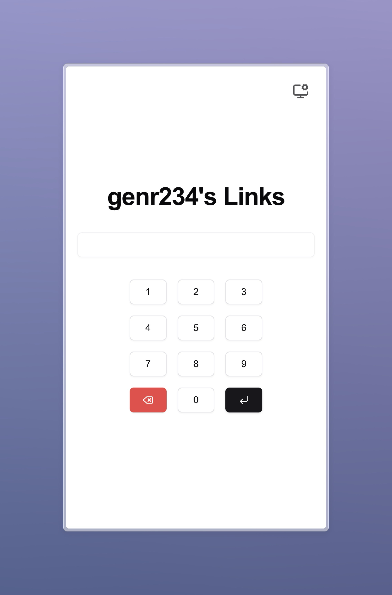
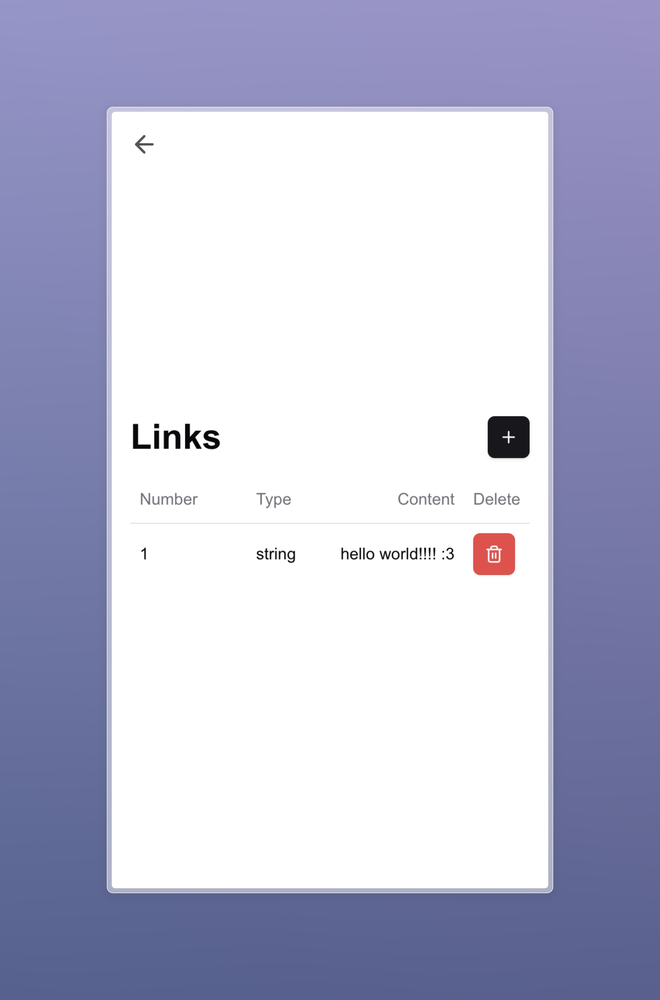
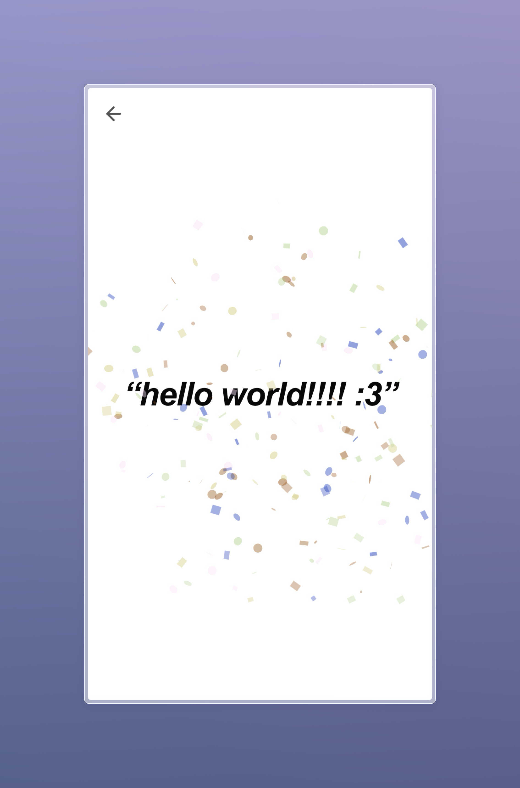

# LinkVault

type 72 on the numpad to try it out!





Store your links, photos, videos and messages behind codes!

## Try it out! (NOW :3)

```bash
git clone https://github.com/genr234/linkvault
cd linkvault
bun i
# Insert your values into .env
nano .env
bun dev
```
Built with ❤️ for [High Seas](hack.club)
